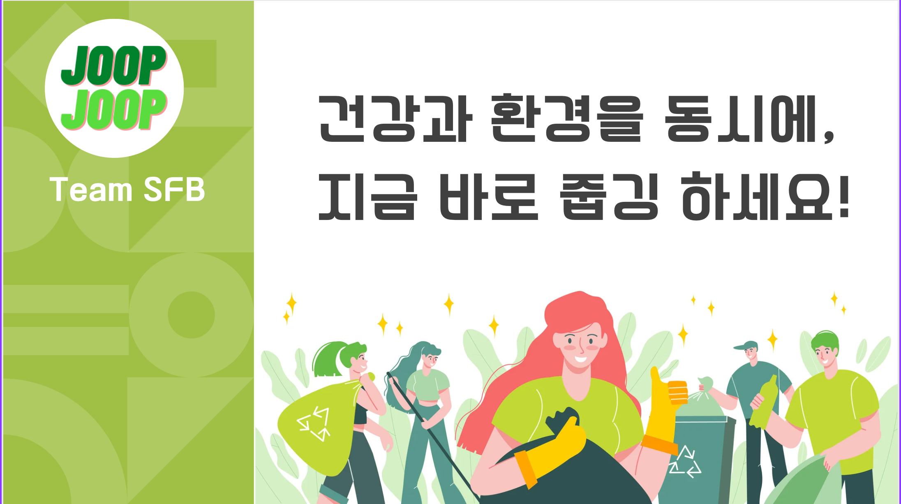
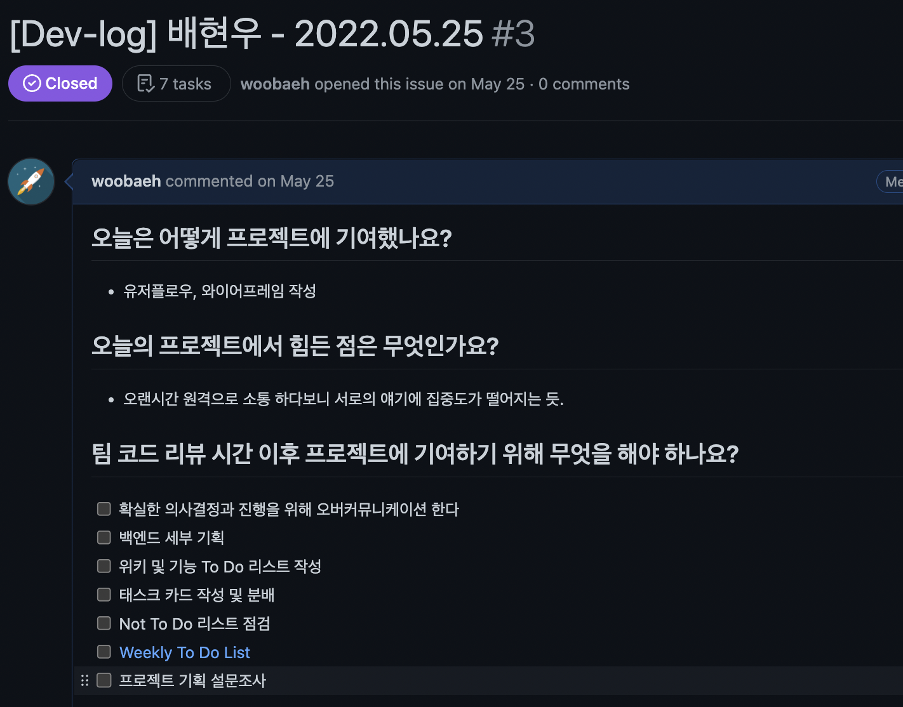
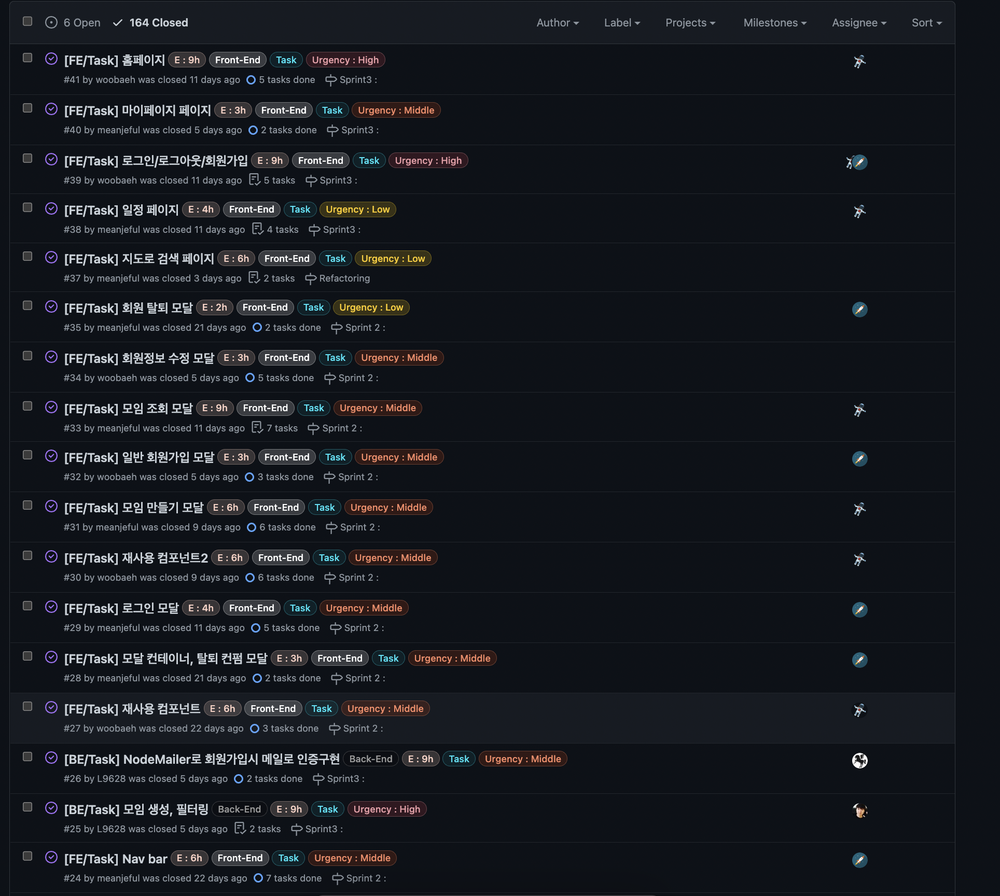
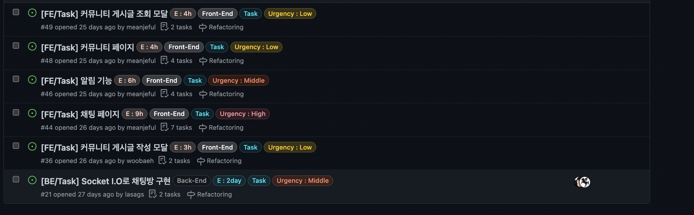
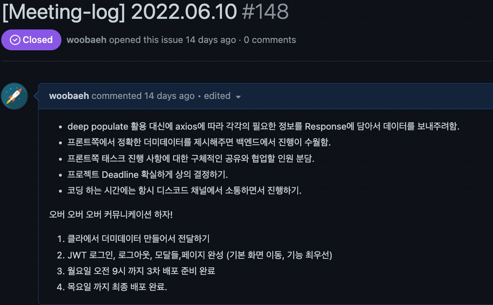

* toc
{:toc .large-only}

[프로젝트 발표 영상](https://youtu.be/UWLnJ3xAH18)

오늘 마침내 22주간의 부트캠프 일정이 마무리 되었습니다.

4주간 파이널 프로젝트를 진행하면서 배운 점과 개인적으로 개선할 점에 대해 회고 해보려고 합니다.

저희 팀이 만든 줍줍이라는 서비스는 온디맨드 서비스로서
랜딩페이지에서 줍깅이라는 개념을 소개하고 모임 개설을 통한
실천을 독려하자는 목표로 만들어졌습니다.

블로깅을 위해 첫날 쓴 팀원들의 데브로그와 마지막날 데브로그 까지 다시 한번 살펴 보았습니다.
다음은 제가 첫날 작성한 Dev-log 입니다.

### 일단 기록하기

SR 기획에 5일 정도가 소요 되었고 모든 의사결정은 전체적인 팀원의 뜻에 따랐습니다.
하루 8시간이상을 원격으로 소통하다 보니 간혹 집중도가 떨어졌던 것 같습니다.

이때부터 오버커뮤니케이션이 중요하다고 제 자신과 팀원들에게 상기시키고 있는 모습이네요.

아래는 프로젝트 기간 동안 팀원들이 작성한 태스크 카드, 에러핸들링, 데브로그의 총합입니다.
164개 글이 작성되고 수행되고 6개의 태스크는 리팩토링과 추가 및 추가 구현을 위해 남겨져 있습니다.

### 작성한 태스크 카드, 에러핸들링, 데브로그의 총합

### 충돌

몇가지 태스크 같은 경우 구현 예상일을 너무 짧게 지정해서 태스크가 밀리게 되자 조급합이 생기기도 했습니다.

그런 와중에 백엔드 사이드에서 프론트사이드에서 더미데이터를 생성해서 소통해달라고 요청했는데 정신없이 다른 태스크를 진행하고 주말간 깜빡 잊어버려서 며칠뒤에 이 문제로 팀적인 소통을 개선하자는 의견이 나왔습니다.

### 해결책

1. 서로가 TMI라고 생각하고 상대방이 알거라도 판단하지 말고 더욱 오버커뮤니케이션 하자!
2. 팀의 미팅 내용을 기록한 미팅-로그 또한 작성하자는 의견이 나왔습니다.

두가지 모두 실행하기로 하였고 다음은 최종 배포까지 1주일을 남겨두고 작성한 미팅 로그 입니다.
- 제가 작성한 글이었는데 다시 읽어도 그때 당시의 위급한 기억이 살아나는 것 같네요...

## 느낀 점

#### 확실하고 구체적인 소통을 하자
나름대로 매일 서로의 데브로그도 공유하고 소통을 많이 했다고 생각했지만 오산이었어요...
본인에게 주어진 태스크를 기한 안에 완성하지 못하게 된다면 어떤 노력을 했고 어떻게 하면 좋을지 팀원들과 바로바로 소통 했다면 더 빠르게 기능 구현을 했을 거라고 생각합니다.
이 부분을 개선해야 한다고 느꼈습니다.

#### 완벽하지 않아도 일단 시도하자
이건 팀원분에게 받은 피드백이고 피드백을 주신 팀원에게 많이 배우게 된 부분입니다.
완벽한 결과를 만들어내지 못할건데 완벽하게 준비된 상태로 새로운 스택을 적용시키려고 하다보니
기능구현이 지연되는 결과를 맞이했던 것 같습니다. 예전부터 너무나도 당연한 마인드셋이라고 여겼던 부분인데
망각하고 있다가 좋은 팀원 덕분에 망치로 머리 한대 맞은 기분이랄까요?

#### 큰 그림을 보고 어떻게 하면 새로운 기능이나 디테일이 변화를 줄 수 있는지 작은 그림까지 볼 수 있도록 노력하자

### 그리고... 이제 다시 취업을 향해 스프린트!
