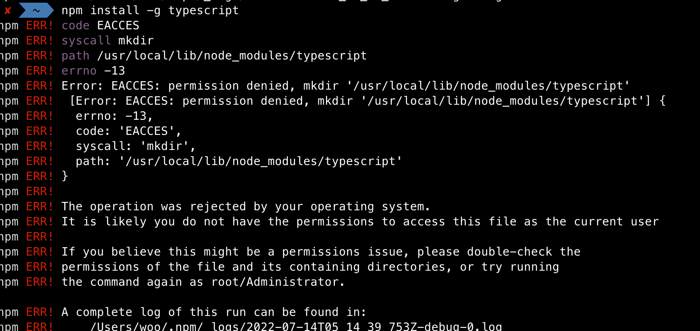
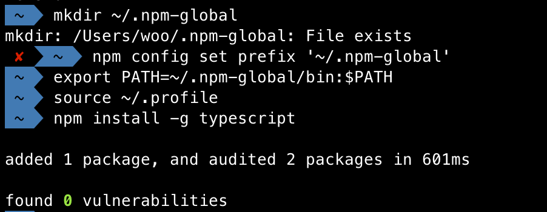

npm install -g 전역 설치 시

아래와 같은 에러가 발생하는 경우가 있습니다.
여기서는 typescript를 전역으로 설치 시
아래와 같이 에러가 발생하였습니다.

에러 메시지에서 보여지듯이

/usr/lib/node_modules에 대한 권한이 없어서 생기는 오류 메시지 입니다.

가장 간단한 해결방법은
관리자 권한인 sudo로 설치를 하면 해결됩니다.

하지만 npm 공식 사이트에서는
npm 기본 경로를 변경해서 사용할 것을 권장합니다.
참고 : [npm 사이트](https://docs.npmjs.com/resolving-eacces-permissions-errors-when-installing-packages-globally#manually-change-npms-default-directory)

해결방법
홈 디렉터리에서 전역 설치를 위한 디렉터리를 만듭니다
- mkdir ~/.npm-global

새 디렉토리 경로를 사용하도록 npm 구성합니다
- npm config set prefix '~/.npm-global'

텍스트 편집기에서 ~/.profile 파일을 열거나 만들고
다음 줄을 추가합니다
- export PATH=~/.npm-global/bin:$PATH

시스템 변수를 업데이트합니다.
- source ~/.profile

테스트하려면 sudo를 사용하지 않고 전역 적으로 패키지를 설치합니다
- npm install -g typescript
에러 없이 설치되는 것을 확인할 수 있습니다.

