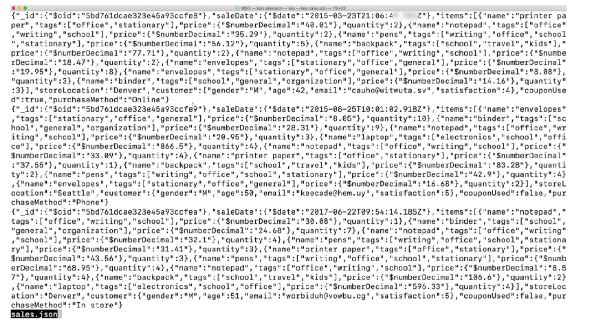

# MongoDB 기초 & Atlas Cloud

## **MongoDB**

MongoDB는 대표적인 NoSQL 도큐먼트 데이터베이스입니다. 도큐먼트 데이터베이스는 데이터를 테이블이 아닌, 문서처럼 저장하는 데이터베이스를 의미합니다. 일반적으로 도큐먼트 데이터베이스에서는 JSON 유사 형식으로 데이터를 문서화합니다. 각각의 도큐먼트는 데이터를 `필드-값` 의 형태로 가지고 있고, 컬렉션이라고 하는 그룹으로 묶어서 관리합니다.

## **Achievement Goals**

- NoSQL의 장점 및 특징에 대해서 이해할 수 있다.
  - 비구조적인 대용량의 데이터를 저장, 필요에 따라서 새로운 데이터 유형 추가
  - DB를 수평적 확장의 형태로 증설, 이론상 무한대로 서버를 분산시켜 DB를 증설
  - 스키마를 준비할 필요가 없어서 빠르게 프로토타입 출시,데이터 구조 업데이트를 하는 경우에 적합
- MongoDB의 도큐먼트(Document)와 컬렉션(Collection)에 대해 이해할 수 있다.

  도큐먼트는 객체와 같이 데이터를 `필드-값` 쌍(Field - Value pair)으로 저장하고 구성합니다.도큐먼트에서 필드는 데이터의 고유한 식별자이고, 값은 주어진 식별자와 관련된 데이터를 뜻합니다.

  

  위 예제에서 `name`이란 필드의 값은 `kimcoding`입니다. 이러한 도큐먼트의 모음을 컬렉션이라고 합니다. 그리고 데이터베이스는 여러 개의 컬렉션으로 구성됩니다.

  ## **용어 정리**

  - **도큐먼트(Document)** 필드 - 값 쌍으로 저장된 데이터
  - **필드(Field)** 데이터 포인트를 위한 고유한 식별자
  - **값(Value)** 주어진 식별자와 연결된 데이터
  - **컬렉션(Collection)**

    MongoDB의 도큐먼트로 구성된 저장소입니다.일반적으로 도큐먼트 간의 공통 필드가 있습니다.데이터베이스 당 많은 컬렉션이 있고, 컬렉션 당 많은 도큐먼트가 있을 수 있습니다.

  - JSON과 BSON의 차이점을 이해하고, 도큐먼트를 가져오거나 내보낼 수 있다.

    shell을 이용하여 도큐먼트를 조회하거나 업데이트할 때, 도큐먼트는 JSON(JavaScript Object Notation) 형식으로 출력됩니다.JSON 형식으로 도큐먼트를 작성하기 위해서는, 다음과 같은 조건을 만족해야 합니다.

    - `{}` 중괄호로 도큐먼트가 시작하고, 끝나야 합니다.
    - 필드와 값이 콜론(`:`)으로 분리되어야 하며, 필드와 값을 포함하는 쌍은 쉼표(`,`)로 구분됩니다.
    - 문자열인 필드도 쌍따옴표(`""`)로 감싸야 합니다.

    다음의 이미지는 JSON 형식으로 도큐먼트를 작성할 때의 올바른 예시입니다.

    

- JSON과 BSON의 차이점을 이해하고, 도큐먼트를 가져오거나 내보낼 수 있다.

  JSON의 형태로 데이터를 저장할 때 단점도 존재합니다.

  JSON은 텍스트 형식이기 때문에 읽기 쉽지만, 파싱이 느리고 메모리 사용이 비효율적입니다.
  그리고 JSON은 기본 데이터 타입만을 지원하기 때문에, 사용할 수 있는 데이터 타입에 제약이 있습니다.

  이런 문제점을 해결하기 위한 방안으로

  [BSON](http://bsonspec.org/)(Binary JSON) 형식을 도입하였습니다.다음은 BSON 예시입니다.

  BSON은 컴퓨터의 언어에 가까운 이진법에 기반을 둔 표현법입니다. 따라서 JSON 보다 메모리 사용이 효율적이며 빠르고, 가볍고, 유연합니다.뿐만 아니라, BSON의 사용으로 더 많은 데이터 타입을 사용할 수 있습니다.

  MongoDB는 JSON 형식으로 작성된 것은 무엇이든 데이터베이스에 추가할 수 있고, 쉽게 조회할 수 있습니다.그러나 그 내부에서는 속도, 효율성, 유연성의 장점이 있는 BSON으로 데이터를 저장, 사용하고 있습니다.

  \***\*Importing & Exporting\*\***

  

  - 데이터를 가져오거나(import), 내보내는(export) 경우에 따른 효율적인 데이터 형식이 존재합니다.
  - MongoDB의 데이터는 BSON의 형태로 저장이 되고, 보통 읽기 쉬운 JSON의 형태로 출력됩니다.
    두 형식의 특징이 다르기 때문입니다.
  - 만약 단순히 백업 저장을 하기 위해서라면 가볍고 빠른 BSON의 형태를 사용하는 편이 좋습니다.
  - 그러나 데이터를 내보낸 후 조회를 하거나 출력을 해야 한다면 사람이 읽기 쉬운 JSON의 형식이 바람직합니다.

  크게 두 가지로 나뉩니다.

  먼저 JSON 형식으로 데이터를 가져오고 내보내기 위한 명령어인 mongoimport와 mongoexport가 있고,
  BSON 형식으로 가져오고 내보내기 위한 명령어인 mongorestore와 mongodump가 있습니다.

  

  이를 사용하기 위해서는 Atlas Cluster URI가 필요합니다.
  해당 URI는 일반 웹의 URI와 형식이 같고, username, password, cluster 주소로 이루어져 있습니다.

  

  dump라는 폴더 안에 sample_supplies 데이터베이스 폴더가 생성되었고,
  그 안에는 다시 sales.bson 파일이 생긴 것을 볼 수 있습니다.

  그리고 sale.bson이라는 파일을 열어보니,
  아래와 같이 읽기 어려운 BSON 형식의 데이터를 확인할 수 있습니다.

  

  mongoexport를 사용하여, JSON 형식의 데이터를 내보낼 때에는 내보낼 컬렉션과 파일의 이름을 정확히 명시해야 합니다.

  그리고 로컬 머신으로 내보낸 sales.json 파일을 열어보겠습니다

  

  

  BSON 형식의 데이터를 가져올 경우에는 mongorestore를 사용하지만
  JSON 형식의 데이터를 가져올 경우에는 mongoimport를 사용합니다.

  아까와 마찬가지로 URI를 사용해서 작성하며, 기존에 있는 데이터를 삭제하기 위한 옵션인 drop 쿼리문은 선택적으로 사용할 수 있습니다.

  

  이 예시에서는 mongodump를 통해 가져온 BSON 형식의 파일을 다시 mongorestore를 통해 아틀라스 클러스터로 복원 시켜보도록 하겠습니다.
  아틀라스 클러스터 입장에서는 로컬 머신으로 내보냈던 dump 파일을 다시 가져가는 개념입니다.

  터미널에 done이라고 표시되면서 mongorestore가 완료되었습니다.

  

  mongorestore와 마찬가지로,
  mongoimport는 데이터베이스를 다시 아틀라스 클러스터로 가져올 수 있게 합니다.

  이때 적용되는 데이터의 형식은 JSON 뿐 아니라, csv와 같은 데이터 형식일 수도 있습니다.

  그리고 파란색 블록에서는 해당 데이터가 삽입되는 컬렉션을 지정하지 않았지만,
  아래 초록색 블록과 같이 컬렉션 이름을 지정하는 등의 부가적인 옵션을 추가 할 수 있습니다.

  이렇게 가져오기(Import) 명령어인 mongorestore와 mongoimport에 대해서 알아보았습니다.

- MongoDB의 Atlas에 대해 이해할 수 있다

  - 클러스터(Cluster)와 레플리카 세트(Replica set)에 대해 이해할 수 있다.

    ## **Atlas Cloud**

    - MongoDB에서는 아틀라스(Atlas)로 클라우드에 데이터베이스를 설정합니다.
    - 아틀라스는 GUI와 CLI로 데이터를 시각화, 분석, 내보내기, 그리고 빌드하는 데에 사용할 수 있습니다.
    - 아틀라스 사용자는 클러스터를 배포할 수 있으며, 클러스터는 그룹화된 서버에 데이터를 저장합니다.

    

  - 클러스터 : 인스턴스들의 모임, 하나의 시스템처럼 작동
  - 레플리카 세트: 단일 클러스터에서 각각의 인스턴스가 가진 복제본 모음

  이 서버는 레플리카 세트(Replica set)로 구성되어 있으며, 레플리카 세트는 동일한 데이터를 저장하는 몇 개의 연결된 MongoDB 인스턴스의 모음입니다.

  - 인스턴스는 특정 소프트웨어를 실행하는 로컬 또는 클라우드의 단일 머신입니다. 이 경우에서 인스턴스는 클라우드에서 실행되는 MongoDB 데이터베이스입니다.

  

  도큐먼트나 컬렉션을 변경할 경우, 변경된 데이터의 중복 사본이 레플리카 세트에 저장됩니다.이 설정 덕분에 레플리카 세트의 인스턴스 중 하나에 문제가 발생하더라도 데이터는 그대로 유지되며, 레플리카 세트의 애플리케이션에서 나머지 작업을 할 수 있습니다.
  이 과정을 위해 클러스터(서버 그룹)를 배포하면, 자동으로 레플리카 세트가 구성됩니다.

  ## **용어 정리**

  - **레플리카 세트**

    동일한 데이터를 저장하는 소수의 연결된 머신을 뜻합니다. 레플리카 세트 중 하나에 문제가 발생하더라도, 데이터를 그대로 유지할 수 있습니다.

  - **인스턴스**

    로컬 또는 클라우드에서 특정 소프트웨어를 실행하는 단일 머신, MongoDB에서는 데이터베이스입니다.

  - **클러스터**

    데이터를 저장하는 서버 그룹으로 여러 대의 컴퓨터를 네트워크를 통해 연결하여 하나의 단일 컴퓨터처럼 동작하도록 제작한 컴퓨터를 뜻합니다.

- Atlas를 GUI(Graphical User Interface)와 shell 쿼리문으로 사용할 수 있다.

  [https://cloud.mongodb.com/v2/6259042d9bc6263074e7c4bc#clusters](https://cloud.mongodb.com/v2/6259042d9bc6263074e7c4bc#clusters)

  [https://www.mongodb.com/docs/v4.4/mongo/](https://www.mongodb.com/docs/v4.4/mongo/)
